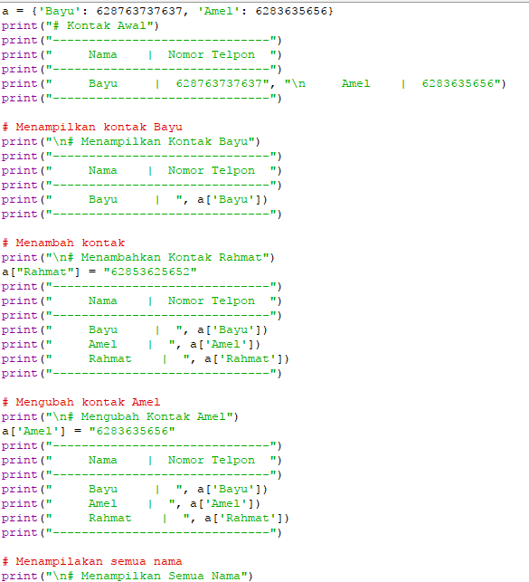
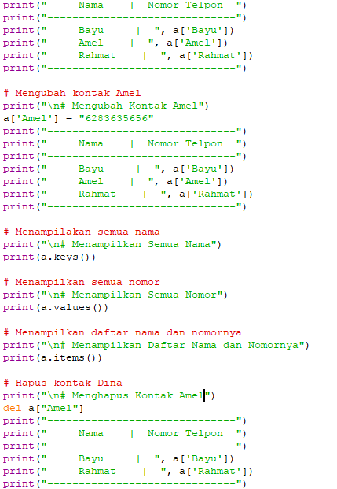
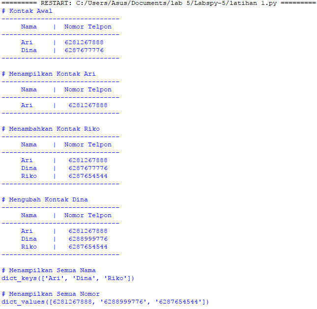
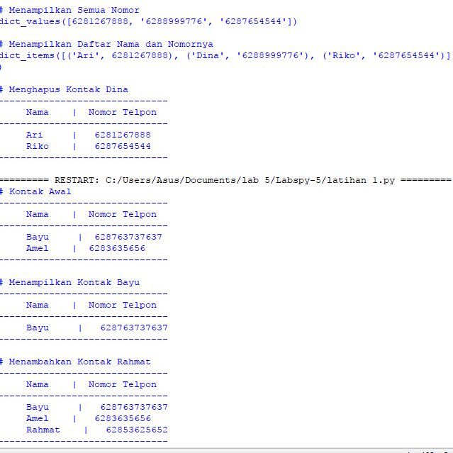
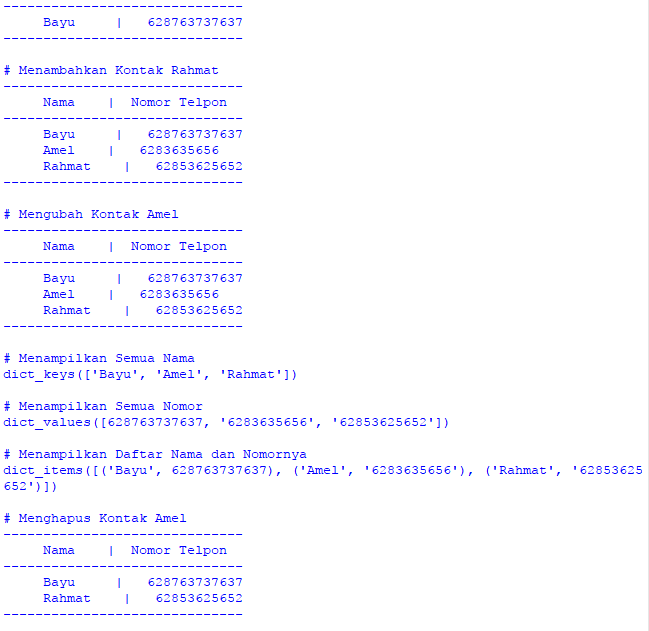
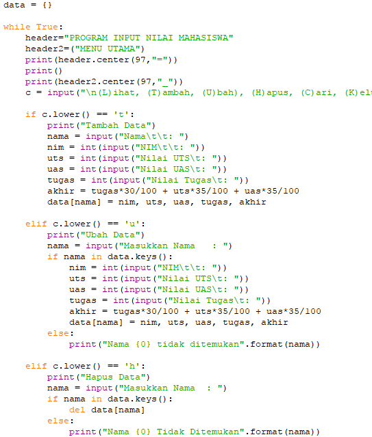
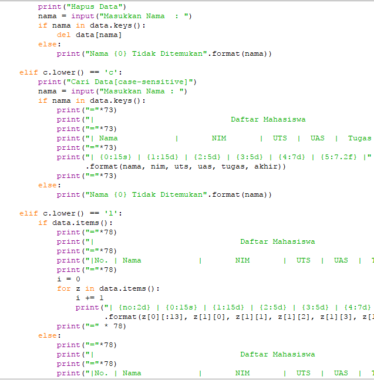
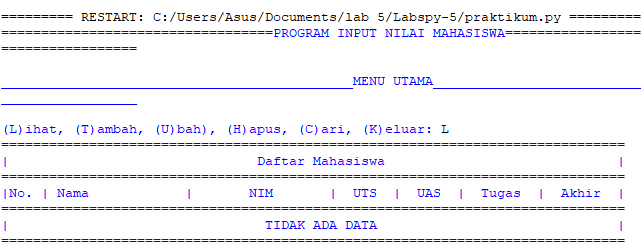

# Labspy-5
## Latihan 1

## PROGRAM

## Penjelasan
*Kontak Awal

a = {'Bayu': 628763737637, 'Amel': 6283635656}

*Untuk menampilkan kontak Ari dapat menggunakan

a['Bayu']

*Kemudian untuk menambahkan kontak Riko dengan nomor 628765454 dapat menggunakan

a["Rahmat"] = "62853625652"'

*Sedangkan untuk mengubah kontak dapat menggunakan

a['Amel'] = "6283635656"

*Untuk menampilkan semua nama dapat menggunakan

print(a.keys())

*Sedangkan untuk menampilkan nomor dapat menggunakan

print(a.values())

*Kemudian untuk menampilkan nama dan nomor dapat menggunakan

print(a.items())

*Untuk menghapus kontak Dina dapat menggunakan

del a["Amel"]

## OUTPUT

## Praktikum

## PROGRAM

## Penjelasan
*Buatlah kamus yang akan diinput dengan data

data  = {}

*Membuat perulangan dan keterangan untuk pilihan menu

while  Benar :
     c  =  input ( " \n (L)ihat, (T)ambah, (U)bah), (H)apus, (C)ari, (K)eluar: " )

*menambahkan data yang akan diinput kemudian masuk ke dalam kamus

jika  c . lower () ==  't' :
         print ( "Tambah Data" )
         nama  =  input ( "Nama \t \t : " )
         nim  =  int ( input ( "NIM \t \t : " ))
         uts  =  int ( input ( "Nilai UTS \t : " ))
         uas  =  int ( masukan ( "Nilai UAS \t : "))
         tugas  =  int ( input ( "Nilai Tugas \t : " ))
         akhir  =  tugas * 30 / 100  +  uts * 35 / 100  +  uas * 35 / 100 
        data [ nama ] =  nim , uts , uas , tugas , akhir

*Jika ingin menampilkan data dapat menggunakan

elif  c . lower () ==  'l' :
         jika  data . item ():
             print ( "=" * 78 )
             print ( "| Daftar Mahasiswa |" )
             print ( "=" * 78 )
             print ( "|No. | Nama | NIM | UAS | Tugas | Akhir |" )
             cetak ( "=" =  0 
            untuk  z  dalam  data . item ():
                 i  +=  1 
                print ( "| {no:2d} | {0:15s} | {1:15d} | {2:5d} | {3:5d} | {4:7d} | {5 :7.2f} |" 
                      . format ( z [ 0 ][: 13 ], z [ 1 ][ 0 ], z [ 1 ][ 1 ], z [ 1 ][ 2 ], z [ 1 ][ 3 ], z [1 ][ 4 ], no = i ))
             print ( "="  *  78 )
         else :
             print ( "=" * 78 )
             print ( "| Daftar Mahasiswa |" )
             print ( "=" * 78 )
             print ( "| No | Nama | NIM | UTS | UAS | Tugas | Akhir |" )
             print ( "=" *78 )
             print ( "| TIDAK ADA DATA | " )
             print ( "=" * 78 )

*Mengubah data dapat menggunakan

elif  c . lower () ==  'u' :
         print ( "Ubah Data" )
         nama  =  input ( "Masukkan Nama : " )
         jika  nama  di  data . kunci ():
             nim  =  int ( masukan ( "NIM \t \t : " ))
             uts  =  int ( masukan ( "Nilai UTS \t : " ))
             uas  =  int( input ( "Nilai UAS \t : " ))
             tugas  =  int ( input ( "Nilai Tugas \t : " ))
             akhir  =  tugas * 30 / 100  +  uts * 35 / 100  +  uas * 35 / 100 
            data [ nama ] =  nim , uts , uas , tugas , akhir 
        else :
            print ( "Nama {0} tidak ditemukan" . format ( nama ))

*Menghapus data dapat menggunakan

elif  c . lower () ==  'h' :
         print ( "Hapus Data" )
         nama  =  input ( "Masukkan Nama : " )
         jika  nama  di  data . keys ():
             del  data [ nama ]
         else :
             print ( "Nama {0} Tidak Ditemukan" . format ( nama ))

*Mencari data dapat menggunakan

 elif  c . lower () ==  'c' :
         print ( "Cari Data[case-sensitive]" )
         nama  =  input ( "Masukkan Nama : " )
         jika  nama  di  data . kunci ():
             print ( "=" * 73 )
             print ( "| Daftar Mahasiswa |" )
             print ( "=""| Nama | NIM | UTS | UAS | Tugas | Akhir |" )
             print ( "=" * 73 )
             print ( "| {0:15s} | {1:15d} | {2:5d} | {3:5d} | {4:7d} | {5:7.2f} | " 
                  . Format ( nama di , nim , UTS , uas , Tugas , Akhir ))
             print ( = "" * 73 )
         lain :
             print ( "Nama {0} tidak ditemukan" . Format (nama ))

*Jika sudah selesai input pilih menu 'K' untuk memberhentikan program

elif  c . lower () ==  'k' :
         break

## OUTPUT

## SELESAI